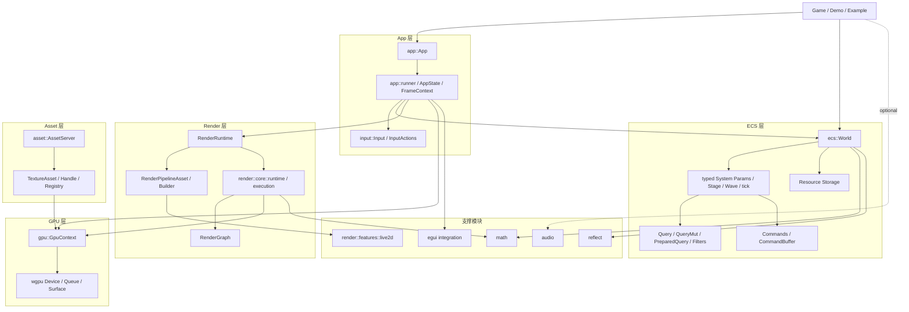
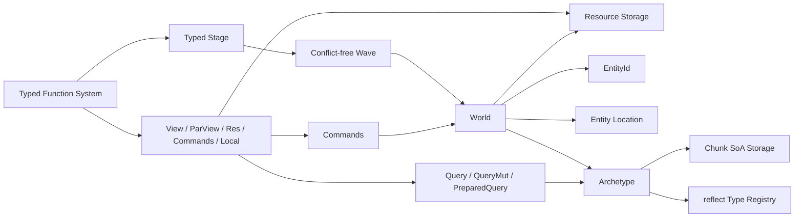
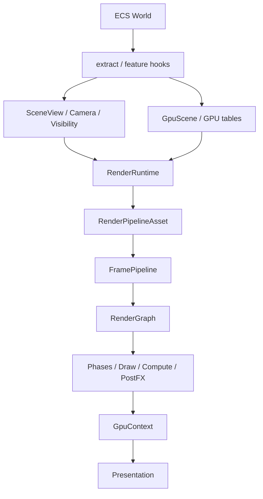
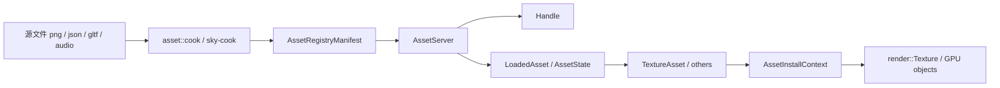
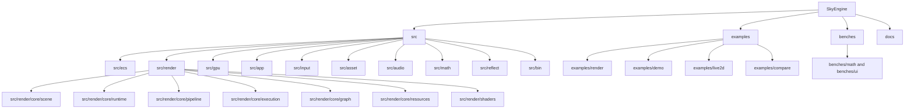

# SkyEngine Architecture

本文档描述 `SkyEngine` 当前仓库的整体架构、核心模块边界、主干调用链、扩展落点与关键不变量。

它的定位是“总览视角”：帮助开发者理解系统如何拼在一起，以及新增功能时应该挂在哪一层。它不替代更细的 API 文档：

- 文档索引见 `docs/README.md`
- API Reference 见 `docs/reference/index.md`
- ECS API 细节见 `docs/reference/ecs.md`
- Reflect API 细节见 `docs/reference/reflect.md`
- GPU / Render 中层 API 细节见 `docs/reference/gpu.md`、`docs/reference/render.md`、`docs/reference/render-expert.md`
- Render 模块维护规则见 `src/render/AGENTS.md`
- RenderGraph 内部规则见 `src/render/core/graph/AGENTS.md`

本文档重点回答：

- 项目分成哪些层？
- ECS、App、Input、Render、Asset、GPU 之间如何协作？
- 渲染系统的真正组合边界在哪里？
- 新 renderer family、asset type、system、GPU table 应该接入哪里？
- 哪些不变量不能破坏？
- 修改某一层后应该跑哪些验证命令？

---

## 目录

- [1. 文档范围](#1-文档范围)
- [2. 总体分层](#2-总体分层)
- [3. 系统上下文图](#3-系统上下文图)
- [4. 应用层 App](#4-应用层-app)
- [5. ECS 层](#5-ecs-层)
- [6. 渲染层 Render](#6-渲染层-render)
- [6.1 Render 总览](#61-render-总览)
- [6.2 Render 分层图](#62-render-分层图)
- [6.3 ECS Authoring 层](#63-ecs-authoring-层)
- [6.4 视图收集与提取层](#64-视图收集与提取层)
- [6.5 PreparedFrame / PreparedView 组合边界](#65-preparedframe--preparedview-组合边界)
- [6.6 Pipeline 声明层](#66-pipeline-声明层)
- [6.7 Phase / Draw Dispatch 层](#67-phase--draw-dispatch-层)
- [6.8 RenderGraph 后端](#68-rendergraph-后端)
- [6.9 Shared GPU Resource 层](#69-shared-gpu-resource-层)
- [6.10 内建 Renderer Families](#610-内建-renderer-families)
- [6.11 Render 每帧执行链](#611-render-每帧执行链)
- [6.12 Render 目录地图](#612-render-目录地图)
- [6.13 Render 设计原则](#613-render-设计原则)
- [6.14 新 renderer family 接入路径](#614-新-renderer-family-接入路径)
- [7. GPU 层](#7-gpu-层)
- [8. Asset 层](#8-asset-层)
- [9. 支撑模块](#9-支撑模块)
- [10. 仓库结构图](#10-仓库结构图)
- [11. 关键运行时调用链](#11-关键运行时调用链)
- [12. 模块关系与扩展决策](#12-模块关系与扩展决策)
- [13. 关键不变量与验证入口](#13-关键不变量与验证入口)
- [14. 当前优势、演进点与常见误区](#14-当前优势演进点与常见误区)
- [15. 建议阅读路径](#15-建议阅读路径)

---

## 1. 文档范围

本文档覆盖以下主干模块：

- `src/app`
- `src/ecs`
- `src/render`
- `src/gpu`
- `src/asset`
- `src/input`
- `src/math`
- `src/reflect`
- `src/audio`
- `examples/` 中与主架构直接相关的示例

本文档不重点展开：

- 单个 shader 的局部数学实现
- Live2D Cubism runtime 的模型、物理、motion 细节
- Criterion benchmark 的逐项结果
- 每个 demo 的玩法逻辑
- 第三方库本身的内部机制

如果需要判断某个概念是否应该进入本文档，可以按这个标准：它是否影响模块边界、扩展方向、主运行链或跨模块不变量。若只是某个 API 的参数细节，通常应该放在 API 文档或源码注释中。

---

## 2. 总体分层

`SkyEngine` 当前可以概括为五层：

1. 应用层：窗口、事件循环、输入、逐帧驱动。
2. 数据与调度层：ECS、实体、组件、资源、查询、系统调度。
3. 渲染编排层：提取、视图构建、pipeline、phase、frame execution。
4. GPU 执行层：`GpuContext`、active frame、纹理、渲染目标、上传与提交。
5. 资产与支撑层：Asset、Math、Reflect、Audio、Live2D、egui 等可选能力。

这五层不是完全独立运行的服务，而是沿着这条主线协作：

```text
App / Example
  -> World / ECS schedule
  -> RenderRuntime / RenderPipelineAsset
  -> FramePipeline / RenderGraph
  -> GpuContext / wgpu
```

### Feature 边界

crate 根部的 feature-gated 模块关系如下：

| Feature | 启用内容 | 主要影响 |
|---------|----------|----------|
| 无额外 feature | `ecs`, `math`, `reflect` | 可运行 ECS、查询、资源、调度与纯 CPU 示例 |
| `asset` | `asset` | 启用 `AssetServer`、manifest、handle、cooked asset 工作流 |
| `app` | `gpu`, `render`, `input`, `app` | 启用 winit / wgpu 应用框架、渲染与输入 |
| `audio` | `audio`，并依赖 `asset` | 启用音频资源、命令与 world 同步 |
| `live2d` | Live2D feature，并依赖 `app` + `asset` | 启用 Cubism SDK 集成与 `Live2DFeature` |
| `egui` | egui overlay，并依赖 `app` | 启用 `FrameContext::egui(...)` 与 egui 示例 |
| `demo` | `app` + `asset` + `rand` | GPU demo 辅助 feature |
| `compare` / `compare-bevy` | 对比示例依赖 | hecs / Bevy 对比示例 |

### 推荐入口

普通应用代码应从这些 facade 进入：

- ECS：`sky_engine::ecs`
- Render：`sky_engine::render`
- App：`sky_engine::app`
- Input：`sky_engine::input`
- GPU：`sky_engine::gpu`
- Asset：`sky_engine::asset`

低层渲染与调试工具可以使用：

- `sky_engine::render::expert`
- `sky_engine::ecs::expert`

这些 expert namespace 不是普通 gameplay 的默认入口。它们用于底层集成、benchmark、工具链、graph 调试或非常明确的性能实验；运行期类型安全的 ECS 工具入口用 `sky_engine::ecs::dynamic`。

### 何时使用哪一层

| 目标 | 推荐入口 | 不建议 |
|------|----------|--------|
| 写 gameplay 状态 | ECS component / resource / system | 把玩法状态放进 renderer cache |
| 批量遍历实体 | world-bound `Query` / `par_for_each` / `for_each_chunk` | dynamic/expert query 作为主路径 |
| 查询中安排结构变化 | `Commands` | active query 内直接 `insert/remove/despawn` |
| 创建窗口应用 | `World::install(...)` + `App` + `AppState` | 手动绕过 runner 复制事件循环 |
| 普通渲染 | `RenderPipelineAsset` + `RenderRuntime` | 直接把所有东西塞进 `GpuContext` |
| 新 renderer family | `RenderFeature` + extractor / payload / phase | 修改中心 scene struct 承载全部状态 |
| 低层 GPU 编排 | `RenderGraph` / `FramePipeline` / `render::expert` | 在 App 层手写跨 pass 资源生命周期 |
| 资产加载 | `AssetServer` / `Handle<T>` / install context | 在 gameplay 中散落文件 IO 与 GPU 上传 |

---

## 3. 系统上下文图



这个图表达的是所有主模块的“拥有与调用方向”，不是每个函数调用的逐行关系。最重要的边界是：

- `World` 拥有 ECS 数据，不拥有 GPU 设备。
- `RenderRuntime` 拥有渲染运行时状态，不拥有 gameplay 语义。
- `GpuContext` 拥有 wgpu device / queue / surface / active frame，不解释场景语义。
- `AssetServer` 管理 asset 状态与加载，不承担完整渲染编排。

---

## 4. 应用层 App

应用层负责把“可运行程序”连接到 ECS、Input、Asset、Audio、Render 和 GPU。

核心文件：

- `src/app/runner.rs`
- `src/app/config.rs`
- `src/app/plugins.rs`
- `src/app/mod.rs`
- `src/input/`

核心对象：

- `App`
- `WindowPlugin`
- `RunnerPlugin`
- `InputPlugin`
- `AssetPlugin`
- `RenderPlugin`
- `WindowOptions`
- `RunnerOptions`
- `RedrawMode`
- `AppState`
- `FrameContext`
- `Input`
- `InputActions`

### 4.1 App 的职责

`App` 是一个薄的应用 runner。它只接收已经装配好的 `World`，然后进入 winit event loop；窗口、输入、资产、runner 策略和渲染管线都通过 `world.install(...)` 显式安装。

应用层负责：

- 按 `WindowPlugin` 声明创建窗口
- 初始化 `GpuContext`
- 在安装 `InputPlugin` 时创建或同步 `Input` resource
- 在安装 `AssetPlugin` 时插入 / 更新 `AssetServer`
- 在安装 `AudioPlugin` 时插入 `AudioServer` / `AudioCommands` 并做帧末同步
- 在启用 `egui` 时接入 egui 输入与 overlay 渲染
- 每帧按 `RunnerPlugin` 策略驱动 `world.tick_with_delta(dt)`
- 调用用户 `AppState`
- 在用户调用 `ctx.render()` 时执行 `RenderPlugin` 声明的 `RenderRuntime`
- 处理 resize、surface lost、timeout、out-of-memory、occluded、shutdown

应用层不负责：

- ECS 存储结构
- 具体渲染算法
- 具体 pass 的资源生命周期
- 资产格式解析细节
- gameplay 规则

### 4.2 App Plugins 与 Options

App 层不再使用一个中心化配置对象承载所有配置。窗口、runner、输入、资产、音频、视频和渲染都是独立能力：

| 插件 | 安装内容 |
|------|----------|
| `WindowPlugin` | `WindowOptions`，声明窗口标题、尺寸、vsync、resizable |
| `RunnerPlugin` | `RunnerOptions`，声明自动 tick、delta clamp、redraw mode、帧率限制 |
| `InputPlugin` | 启用 winit input 到 ECS input resource 的同步 |
| `AssetPlugin` | `AssetConfig`，声明 app-owned asset service |
| `RenderPlugin` | `RenderPipelineAsset`，声明高层 scene pipeline |
| `AudioPlugin` / `VideoPlugin` | feature-gated app service 声明 |

`WindowOptions` 定义窗口策略：

| 字段 | 含义 |
|------|------|
| `title` | 初始窗口标题 |
| `width` / `height` | 初始逻辑尺寸 |
| `vsync` | 是否启用 vsync |
| `resizable` | 是否允许 resize |

`RunnerOptions` 定义帧驱动策略：

| 字段 | 含义 |
|------|------|
| `exit_on_escape` | 是否按 Escape 退出 |
| `max_delta` | 自动 tick 的最大帧间隔，避免调试暂停导致模拟爆炸 |
| `auto_tick` | 是否每帧自动调用 `world.tick_with_delta(dt)` |
| `redraw_mode` | `Continuous` 连续刷新或 `Reactive` 仅脏刷新 |

`auto_tick = true` 是 game-style 默认值。工具、编辑器或测试 harness 若要手动控制 schedule，可以关闭它。

`RedrawMode::Continuous` 适合游戏循环；`RedrawMode::Reactive` 适合 UI 工具、编辑器、低功耗预览器。Reactive 模式下，应用需要通过输入事件、resize 或 `FrameContext::request_redraw()` 继续驱动刷新。

### 4.3 AppState 生命周期

`AppState` 是用户应用状态的结构化生命周期：

```text
App::run(state)
  -> resumed:
       create window
       GpuContext::try_new(...)
       insert Input resource
       optional insert AssetServer
       optional insert AudioServer / AudioCommands
       state.setup(world, gpu)
  -> per frame:
       sync Input resource
       update InputActions resource if present
       optional AssetServer::update()
       optional world.tick_with_delta(dt)
       gpu.begin_frame()
       state.update(FrameContext)
       optional audio command/world sync
       optional egui end_frame overlay
       gpu.end_frame()
       input.begin_frame()
  -> resize:
       gpu.resize_surface(...)
       renderer.resize(...)
       state.on_resize(width, height)
  -> exit:
       state.shutdown(world)
       world.shutdown()
```

各回调职责：

| 回调 | 调用时机 | 推荐用途 |
|------|----------|----------|
| `setup(&mut World, &mut GpuContext)` | GPU ready 且 `Input` resource 已存在后 | 需要 GPU 的 texture / mesh / material 创建，初始实体创建 |
| `update(&mut FrameContext)` | 每帧 | gameplay、手动 query、UI、调用 `ctx.render()` |
| `on_resize(width, height)` | window resize 后 | 应用自己的 resize 状态 |
| `shutdown(&mut World)` | 退出前 | gameplay 级清理 |

### 4.4 FrameContext

`FrameContext` 是每帧传给用户的上下文，包含：

- `world: &mut World`
- `input: &Input`
- `dt: f32`
- `gpu()`：获取 `GpuContext`
- `render()`：执行已安装 render pipeline
- `render_stats()`：读取最近一次渲染统计
- `surface_size()`：读取 surface 尺寸
- `set_title(...)`
- `request_exit()`
- `request_redraw()`
- `feature_mut<T>()`
- `with_feature_mut<T, R>(...)`
- `with_render_runtime_mut(...)`
- `egui(...)`，仅 `egui` feature

`FrameContext::render()` 要求已经安装 `RenderPlugin`，否则会 panic。这是有意的：没有 pipeline 时 App 仍可用于纯 ECS / GPU 自定义流程，但调用高层 render 必须显式安装 renderer。

### 4.5 Input 同步模型

Input 有两层：

- raw layer：`Input`、`KeyCode`、`MouseButton`
- action layer：`InputActions`、`ActionMap`、`InputSource`

App runner 接收 winit `WindowEvent`，更新内部 `Input`。每帧开始时，runner 将 input snapshot 写入 `World` 中的 `Input` resource：

```text
winit WindowEvent
  -> runner internal Input
  -> per-frame sync into World resource
  -> optional InputActions::update(&Input)
  -> AppState::update(FrameContext)
```

raw layer 适合直接问“某个键是否按下”。action layer 适合 gameplay 语义，例如 `jump`、`move`、`dash`，支持组合轴、运行时 rebinding 和 action map enable / disable。

### 4.6 Resize 与 Surface 错误

resize 链路：

```text
WindowEvent::Resized(size)
  -> GpuContext::resize_surface(width, height)
  -> RenderRuntime::resize(gpu, width, height)
  -> AppState::on_resize(width, height)
  -> request redraw if non-zero
```

surface lost / timeout / out-of-memory 链路：

- `SurfaceLost`：通知 renderer `surface_lost()`，重建 surface 配置，再 resize renderer。
- `Timeout`：清空 last frame time 并请求重画。
- `OutOfMemory`：请求退出。
- 其它 GPU 错误：记录错误并尝试继续。

这意味着 renderer 必须能响应 `resize` 和 `surface_lost`，不能把 surface-dependent resource 当成永远稳定。

---

## 5. ECS 层

ECS 是当前项目的运行时数据核心。它提供实体、组件、资源、查询、延迟命令与轻量 schedule。

SkyEngine 的本地入口是 `src/ecs/mod.rs`，它重新导出独立
[`sky_ecs`](https://github.com/jz315/SkyECS) crate。ECS 存储、查询、命令、
schedule、示例和 benchmark 的源码均在 SkyECS 仓库维护。

公共入口：

```rust
use sky_engine::ecs::{
    Any, Bundle, CommandBuffer, Commands, EntityId, PreparedQuery, Query, QueryData,
    ParView, QueryMut, Res, ResMut, Time, Update, View, With, Without, World,
};
```

底层工具 / benchmark 入口：

```rust
use sky_engine::ecs::{dynamic, expert};
```

### ECS 架构图



### 5.1 World

`World` 是实体、组件、资源、archetype storage 和 schedule 的统一中心。

它负责：

- `spawn` / `spawn_batch`
- `insert` / `remove` / `despawn`
- `contains` / `has` / `get` / `get_mut`
- archetype epoch 维护
- storage epoch 维护
- entity location 维护
- resource singleton 存取
- typed stage、access graph 与 compiled wave 维护
- `tick` / `tick_with_delta` / `shutdown`

`World` 不负责：

- window event loop
- GPU frame 提交
- asset 文件 IO 的具体解析
- renderer pass 执行

### 5.2 EntityId 与 entity location

`EntityId` 是 generational handle，由 index + generation 组成。实体槽位复用时 generation 会变化，因此旧 ID 会失效。

核心不变量：

- `World::contains(entity)` 必须拒绝 stale generation。
- 结构迁移、despawn、swap-compact 后，被移动实体的 location 必须更新。
- entity location 必须始终能定位到实体当前所在 archetype、chunk 和 row。

这个设计允许用户长期保存 `EntityId`，同时避免访问已被 despawn 后复用的实体。

### 5.3 Archetype 与 chunked SoA

存储模型是 archetype + chunked columnar SoA：

```text
World
  -> Archetype A: [Position, Velocity]
       -> Chunk 0
            Position column: P0 P1 P2 ...
            Velocity column: V0 V1 V2 ...
       -> Chunk 1
            ...
  -> Archetype B: [Position, Health]
       -> Chunk 0
            Position column: ...
            Health column: ...
```

设计要点：

- component 数据按列存储，不是 entity-interleaved。
- `CHUNK_SIZE` 在独立 SkyECS 仓库的 `crates/sky_ecs/src/ecs/chunk.rs` 中维护，当前为 `512 * 1024` bytes。
- archetype component list 会按 component type ID 排序，不保留 bundle builder 插入顺序。
- component-index lookup 使用 thread-local last-hit cache 加 binary search。
- chunk backing block 按线程池化，并有 retained budget。
- 每个 archetype 可缓存一个空 `spare_chunk`，降低 spawn/despawn churn 的 pool 往返。

这个布局服务于 hot query 的 cache locality 和 chunk-level vectorization。

### 5.4 Bundle 与 spawn

普通实体创建首选 bundle：

```rust
world.spawn((A, B, C));
world.spawn_batch(items);
```

bundle 的职责是：

- 提供 tuple component metadata
- 生成目标 archetype
- 按 archetype column layout 写入组件
- 支持非 `Copy` component 的正确移动与 drop

当前 tuple bundle 支持到 8 个组件。同一个 bundle 中重复组件类型会被拒绝。

### 5.5 结构变化链路

结构变化包括：

- spawn：创建 entity slot，选择或创建 archetype，写入组件。
- insert：向实体添加 component，迁移到新 archetype。
- remove：从实体移除 component，迁移到新 archetype。
- despawn：移除实体，drop 组件，swap-compact chunk row。
- clear / world drop：drop 所有非 `Copy` component 和资源。

insert / remove 的高层模型：

```text
entity at old archetype
  -> compute new component set
  -> find/create target archetype
  -> use transition plan / copy spans
  -> move shared components
  -> write inserted component or drop removed component
  -> update entity location
  -> swap-compact old row if needed
  -> bump archetype epoch if archetype set changed
  -> bump storage epoch for every layout change
```

关键点：

- 迁移不是按字段语义理解 component，而是按 type-erased layout 搬移。
- 非 `Copy` component 必须只 drop 一次。
- 被 swap 到旧 row 的实体必须更新 location。
- transition plan / copy span cache 是结构热路径，不应随意换成高分配、低 locality 的实现。

### 5.6 Typed Query

普通运行时查询使用绑定到 world 的只读/可写 facade：

```rust
let query = world.query::<(&Position, &Velocity)>();
let mut writable = world.query_mut::<(&mut Position, &Velocity)>();
let filtered = world.query::<&Position>().filter::<With<Velocity>>();

#[derive(QueryData)]
struct Movement<'w> {
    position: &'w mut Position,
    velocity: &'w Velocity,
}
```

`World` 内部按 `(Q, Flt)` 类型缓存 query plan。绑定查询惰性获取最终 plan，避免 `.filter::<F>()` 先扫描无过滤版本。缓存的核心机制：

- 根据 `Q` 生成 typed query spec。
- 根据 `Flt` 生成 archetype filter。
- 缓存匹配 archetype。
- 记录 `World::archetype_epoch()`。
- 当 epoch 改变时自动刷新缓存。
- 新 archetype 仅扫描追加的 suffix；`clear` 等非追加变化会完整重建。
- bound parallel job 划分也缓存在 `World`，重复构造轻量 query 不会重复生成 job。
- parallel job 命中仅比较 World identity 和 `storage_epoch`，不遍历 Chunk 签名；组件值更新不失效，所有布局变化都会失效。

`PreparedQuery<Q, Flt>` 保留为高级显式计划：它适合存进 system / extractor、跨 world 复用，以及长期复用 parallel job cache；遍历时仍显式接收 world。

支持参数：

- `&T`
- `&mut T`
- `Option<&T>`
- `Option<&mut T>`
- `#[derive(QueryData)]` 命名字段查询

支持过滤器：

- `With<T>`
- `Without<T>`
- `Any<(...)>` OR filter
- 最多 16 项的 AND filter tuple

支持遍历形态：

- entity item：`for_each` / `par_for_each`
- chunk slice：`for_each_chunk` / `par_for_each_chunk`
- entity-aware：`for_each_with_entity` / `par_for_each_with_entity`
- chunk + entity ids：`for_each_chunk_with_entities` / `par_for_each_chunk_with_entities`
- `count` / `is_empty` / `cached_archetype_count`

查询设计原则：

- application / system hot path 优先 typed query。
- entity-level parallel iteration 是常规并行系统入口；chunk iteration 用在需要切片、SIMD 或批处理的 hot loop。
- optional param 用于跨 archetype 的可选 component，不应替代清晰的数据建模。
- 重复 component 类型在同一 query 中被拒绝，这是有意的 aliasing 防线。

### 5.7 并行查询限制

并行查询把 Chunk 切成连续 4096-entity stripe 后交给 Rayon；stripe、chunk 和实体执行顺序未定义。低于任务阈值时自动回退到顺序执行。

并行闭包中应遵守：

- 不直接做结构修改。
- 不捕获普通 `&mut` 外部状态。
- 需要收集结果时使用 owned buffer、atomic、channel 或 `Mutex`。
- 需要资源输入时，先在并行阶段前复制需要的只读数据。
- 需要结构变化时，先并行收集 entity，再顺序 `Commands::apply()` 或调用 `World` API。

### 5.8 Commands

`Commands` 是延迟结构修改路径。

适合场景：

- active query 中决定 spawn/despawn/insert/remove。
- system 内收集多批结构变化。
- 希望把结构变化推迟到逻辑阶段末尾统一 apply。

当前语义：

- 保留队列顺序与 barrier 语义。
- entity commands 按首次出现 entity 的顺序 flush。
- 同一实体同一批次的重复 insert/remove 会 coalesce 成最终状态。
- despawn 会吞掉该实体后续同批次 component 修改。
- 相邻同 bundle 类型 spawn 可合并批量创建。
- 支持 resource insert/remove 的 deferred command。

`Commands` 不等于并发写入器。它是把结构变化从查询遍历阶段移到安全 apply 点的机制。

### 5.9 Resources

resource 是 typed singleton，不参与 archetype。

使用场景：

- 全局 game state
- input / action map
- asset server
- audio server / command queue
- 配置表
- 跨 system 共享只读或少量可变状态

resource 生命周期由 `World` 管理。`World::clear()` 清空实体但保留资源；`World` drop 会 drop resource。

### 5.10 System schedule

SkyEngine 不公开可任意改写的 `Schedule` 对象；调度器内置在 `World`，公开面是 typed stage 与 typed system parameters。

核心规则：

- 内置 stage 顺序为 `First -> FixedUpdate -> PreUpdate -> Update -> PostUpdate -> Last`。
- 自定义 stage 必须通过 `insert_stage_after` 显式安装；未知 label 不会静默追加到 `Last` 后面。
- `world.stage(Label).add(system)` 从 `View` / `ParView` / `Res` / `ResMut` / `Commands` 参数推导访问集合。`View` 只准备顺序 plan，`ParView` 才准备并行 stripe jobs。
- stage 内 read/read system 可进入同一 wave；存在写冲突的 system 按注册顺序进入后续 wave。默认至少 3 个 compatible system 才 dispatch 到 Rayon，stage 可调整阈值。
- `add_exclusive` 是完整 `&mut World` 的显式串行 barrier，barrier 前 flush command buffer。
- 普通 system 的命令只在 stage 结束或 exclusive barrier 前按注册顺序合并，worker 完成顺序不影响结果。
- `FixedUpdate` 默认 60 Hz；第一次显式 fixed 配置可覆盖默认值，后续冲突配置会报错而不是 last-writer-wins。`FixedStep` 使用 `f64` accumulator、非零 step、`max_substeps` 和 Drop/Carry overflow 策略。
- `world.tick()` 使用真实时间差。
- `world.tick_with_delta(dt)` 使用指定 delta，并返回 `Result<TickReport, ScheduleError>`。
- `world.shutdown()` teardown system，应用退出时由 App 调用。
- tick 会先对整帧 required resources 做 preflight；失败不会推进时间或运行 system。运行中移除后续必需 resource 属于 invariant panic。
- panic 时 RAII guard 恢复 schedule 并丢弃尚未 flush 的命令；已完成的值写入不回滚。command apply 中途 panic 会 poison World，禁止继续 apply/tick。

`Time` 提供：

- `delta`
- `frame_delta` / `raw_delta`
- `elapsed`
- `frame_count`
- `fixed_alpha`（只对应内置 `FixedUpdate`）
- `time_scale`

fixed stage 中的 `Time::delta` 反映 fixed step；普通 system 只能通过 `Res<Time>` 读取。访问 graph、compiled waves、fixed backlog 和冲突原因可通过 `World::schedule_diagnostics()` 检查。

### 5.11 dynamic / expert API

`ecs::dynamic` 提供运行期类型安全能力：

- 工具链或脚本式 runtime 接入。
- 动态 bundle spawn。
- 带 read/write/optional 声明的动态 query。

`ecs::expert` 提供 unsafe 底层能力：

- 手动创建 archetype。
- 未初始化实体槽位。
- benchmark / engine-level helper。

它们都不是普通 gameplay hot path。不要为了“更直接”绕过 typed query，除非目标就是工具、脚本桥、底层测试或 benchmark。

---

## 6. 渲染层 Render

Render 层负责把 ECS 世界中的渲染 authoring data 转换为 GPU 可执行的 draw / pass / compute / post-fx 工作负载。

它不是一个传统“单 renderer 类”，而是由几类子系统组成：

- ECS authoring 数据
- 相机 / 视图构建
- extract / prepare
- pipeline 声明
- phase / draw dispatch
- typed prepared frame/view payload
- frame pipeline execution
- render graph backend
- shared GPU scene uploads
- renderer-family local cache

公共高层入口：

```rust
use sky_engine::render::{
    RenderRuntime, RenderPipelineAsset, RenderPipelineBuilder, RenderFeature,
    SpriteFeature, OpaquePhase, TransparentPhase, Camera, Color, Texture,
};
```

expert 入口：

```rust
use sky_engine::render::expert::{
    draw::DrawFunction,
    execution::{FramePipeline, PreparedFrame, PreparedView},
    graph::RenderGraph,
};
```

### 6.1 Render 总览



渲染可以分为四个阶段：

| 阶段 | 主要类型 | 发生时机 | 产物 |
|------|----------|----------|------|
| 声明期 | `RenderPipelineBuilder`, `RenderPipelineAsset`, `RenderFeature` | app setup / pipeline construction | pipeline 配置、feature 注册、phase/pass/postfx 顺序 |
| 准备期 | `RenderRuntime`, extractors, `GpuScene`, view collection | 每帧 render 前半段 | `PreparedFrame`, `PreparedView`, phase items, typed payload |
| 执行期 | `FramePipeline`, setup/view/finalize nodes | 每帧 render 后半段 | graph pass、draw dispatch、post-fx、presentation |
| 后端 | `RenderGraph`, `PhysicalResources`, `GpuContext` | pass 编译/执行 | physical texture/buffer、command encoder、queue submit |

### 6.2 Render 分层图

```mermaid
flowchart LR
    subgraph Authoring[Authoring / ECS Authoring]
        Comp[core::scene + features/*\nCamera SpriteRenderer MeshRenderer PointLight]
        ViewTypes[core::view\nCamera Projection Viewport]
    end

    subgraph Runtime[High-Level Runtime]
        RenderRt[RenderRuntime]
        FrameCoordinator[runtime::frame_coordinator]
        ViewCollection[runtime::view_collection]
        Extract[extract]
    end

    subgraph PipelineDecl[Pipeline Declaration]
        Asset[RenderPipelineAsset]
        Builder[RenderPipelineBuilder]
        Features[RenderFeature / SpriteFeature / Live2DFeature]
        Steps[PipelineStep\nPhase / Compute / Pass / PostFx]
    end

    subgraph Execution[Prepared Execution]
        Prepared[PreparedFrame / PreparedView]
        FramePipe[FramePipeline]
        Nodes[setup/view/finalize nodes]
        PhaseState[OpaquePhase / TransparentPhase / payloads]
        Slots[SceneGBufferSlots / ResourceSlotMap]
    end

    subgraph GraphBackend[Graph Backend]
        Graph[RenderGraph]
        Compiled[CompiledPass / ResourceLifetime]
        Physical[PhysicalResources]
    end

    subgraph GPUShared[Shared GPU Resources]
        GpuScene[GpuScene]
        Tables[GpuTableManager / ModelMatrix / LightTable]
        Texture[Texture / RenderTarget]
    end

    Comp --> Extract
    ViewTypes --> ViewCollection
    Builder --> Asset
    Features --> Builder
    Steps --> Asset
    Asset --> RenderRt
    RenderRt --> FrameCoordinator
    ViewCollection --> FrameCoordinator
    Extract --> FrameCoordinator
    FrameCoordinator --> Prepared
    RenderRt --> GpuScene
    GpuScene --> Tables
    Prepared --> FramePipe
    FramePipe --> Nodes
    Nodes --> PhaseState
    Nodes --> Slots
    Nodes --> Graph
    Graph --> Compiled
    Compiled --> Physical
    Physical --> Texture
    Tables --> Physical
```



### 6.3 ECS Authoring 层

这一层保存 ECS 世界中的渲染作者数据。

核心目录：

- `src/render/core/scene/`
- `src/render/core/view/`

典型组件：

- `CameraMarker`
- `MainCamera`
- `CameraViewport`
- `SpriteRenderer`
- `MeshRenderer`
- `PointLight`
- `DirectionalLight`
- `RenderSettings`
- `BloomSettings`
- `ToneMapSettings`
- `VignetteSettings`
- `Parent`
- `Live2DModelInstance`，仅 `live2d` feature

典型视图类型：

- `Camera`
- `Projection`
- `ViewportRect`
- `SceneView`
- `SceneViewKind`
- `Frustum`
- `RenderStats`

职责：

- 用 ECS 组件表达“这个实体如何参与渲染”。
- 用 view 类型表达“如何从世界观察场景”。
- 保存 layer / sorting / viewport / camera semantics。
- 不直接生成 GPU draw call。
- 不直接管理 wgpu resource 生命周期。

新增 gameplay-facing 渲染概念时，优先问：

- 它是否是实体作者数据？放 `component/`。
- 它是否是 camera / viewport / transform / visibility 语义？放 `view/`。
- 它是否只是某 renderer family 的内部 cache？留在 family 目录。

### 6.4 视图收集与提取层

这一层把 `World` 转换成每帧可执行的渲染输入。

核心目录与文件：

- `src/render/core/runtime/frame_coordinator.rs`
- `src/render/core/runtime/view_collection.rs`
- `src/render/core/runtime/composer.rs`
- `src/render/core/extraction/`
- `src/render/core/pipeline/features.rs`

主要步骤：

1. resolve scene transforms。
2. 收集 camera / viewport，构建 `SceneView`。
3. 运行 registered feature `collect_views(...)` hook。
4. 运行 built-in 与注册的 extractors。
5. 填充 `OpaquePhase`、`TransparentPhase` 或其它 phase payload。
6. 运行 feature `extract(...)` / `prepare(...)`。
7. 上传共享 `GpuScene` / GPU tables。
8. 构建 `PreparedFrame` 与每个 visible view 的 `PreparedView`。
9. 让 features 注入 typed frame/view payload。

这一层的输出不是直接 GPU pass，而是：

- `PreparedFrame`
- `PreparedView`
- phase item collections
- typed payload stores
- scene input descriptors
- uploaded GPU tables

### 6.5 PreparedFrame / PreparedView 组合边界

这是当前渲染架构最重要的组合边界。

核心类型：

- `PreparedFrame`
- `PreparedView`
- `FramePipeline`
- `FramePayloadStore`
- `ResourceSlotMap`
- `SceneGBufferSlots`

职责：

- 区分 frame-scope 数据与 view-scope 数据。
- 允许 feature 注入 typed payload。
- 让 Sprite、Mesh、Lighting、PostFX、Live2D 等 renderer family 在同一个执行骨架中协作。
- 将准备期的数据安全传递到执行期。

组合原则：

- 共享给整帧的数据进入 `PreparedFrame`。
- 仅某个视图使用的数据进入 `PreparedView`。
- 跨 renderer 的 canonical scene input 放在 execution helpers / `SceneGBufferSlots`。
- renderer-specific cache 留在该 renderer family 或 feature backend。
- 新 renderer family 优先通过 payload 注入，而不是修改全局中心对象。

这也是当前 render 架构避免“万能 scene struct”膨胀的关键手段。

### 6.6 Pipeline 声明层

`src/render/core/pipeline/` 负责声明渲染结构，而不是保存每帧执行状态。

核心类型：

- `RenderPipelineBuilder`
- `RenderPipelineAsset`
- `RenderPipelineDescriptor`
- `RenderFeature`
- `PipelineStep`
- `PipelineStepDescriptor`
- `RenderPhase`
- `RenderPass`
- `ComputePass`
- `PostFxPass`
- built-in markers：`Bloom`、`ToneMap`、`Vignette`、`DdgiUpdateCompute`、`SceneNormalPrepass`、`SceneMaterialPrepass`

`RenderPipelineAsset` 与 `RenderRuntime` 的区别：

| 类型 | 生命周期 | 拥有什么 | 不应拥有 |
|------|----------|----------|----------|
| `RenderPipelineAsset` | 声明期，可复制配置思想 | feature / phase / pass / postfx / material / draw function / GPU table registrations | live GPU cache、per-frame view state |
| `RenderRuntime` | runtime，随 App 持有 | feature runtime state、pipeline steps、draw registry、material/mesh registry、`GpuScene`、stats | gameplay state、窗口 event loop |

典型 builder 能力：

- `add_feature(...)`
- `add_phase(...)`
- `add_compute(...)`
- `add_pass(...)`
- `add_postfx(...)`
- `add_extractor(...)`
- `add_draw_function(...)`
- `add_gpu_table(...)`
- `register_material::<M>()`

设计目标：

- pipeline 结构必须显式。
- 扩展方式是注册驱动，而不是在核心 runtime 里堆硬编码分支。
- 执行顺序来自 `PipelineStep`，而不是 renderer family 私下抢顺序。

### 6.7 Phase / Draw Dispatch 层

`src/render/core/draw/` 负责排序和 draw dispatch。

核心概念：

- `PhaseItem`
- `DrawFunction`
- `DrawFunctionRegistry`
- `OpaquePhase`
- `TransparentPhase`
- sort key / render queue / order in layer

作用：

- extract / prepare 阶段将可绘制项写入 phase。
- phase 内部按规则排序。
- draw function 根据 phase item 执行具体绘制。
- 多个 renderer family 可以向同一 phase 提交 item，只要 draw function 能解释其 item。

典型流：

```text
Extractor / Feature prepare
  -> create PhaseItem
  -> assign draw function id / sort key / entity or payload reference
  -> push into OpaquePhase or TransparentPhase
  -> FramePipeline phase node
  -> phase sort
  -> DrawFunction dispatch
```

Phase 是“高层提取结果”与“底层 draw 行为”之间的桥接层。不要把 renderer-specific 全局状态偷偷塞进共享执行 context；应通过 typed payload 或 renderer family cache 显式传递。

### 6.8 RenderGraph 后端

`src/render/core/graph/` 是低层 declarative render graph backend。

职责：

- 声明 virtual textures / buffers。
- 声明 render / compute / copy pass 的读写关系。
- 做依赖分析。
- 做 dead-pass culling。
- 做 pass reorder。
- 分析 resource lifetime。
- 做 transient texture aliasing。
- 分配 physical resources。
- 执行 pass。
- 管理 graph blackboard。

核心文件：

- `mod.rs`
- `compile.rs`
- `allocate.rs`
- `reorder.rs`
- `alias.rs`
- `builder.rs`
- `types.rs`
- `execute.rs`
- `pool.rs`
- `error.rs`
- `visualize.rs`
- `tests.rs`

Handle 模型：

- texture / buffer / pass handle 包含 index + `handle_token`。
- `reset()` 会更换 token，使 stale handle 失效。
- 所有访问必须通过 handle validation。
- 外部 graph 的 handle 必须被拒绝。

compile pipeline：

1. Dependency analysis：根据 read / write / readwrite 建图，检测 read-before-write 与 cycle。
2. Dead-pass culling：从 surface、imported resource、persistent resource 等外部 sink 反向保活。
3. Execution reordering：在保持 DAG 约束下提升资源 affinity，压缩 lifetime。
4. Resource lifetime analysis：记录每个资源 first_use / last_use。
5. Memory alias analysis：在 `allocate_physical_resources()` 中基于真实 surface 尺寸进行 transient texture aliasing。

执行模型：

```text
RenderGraph::try_execute(ctx, run_pass)
  -> compile()
  -> allocate_physical_resources(ctx)
  -> for compiled pass:
       Copy pass: graph 内部执行，必要时 flush active frame encoder
       Render/Compute pass: 调用用户闭包
  -> release_transient_resources()
```

需要特别强调：

- `RenderGraph` 很重要，但不是普通用户面对的唯一入口。
- 在当前架构中，`FramePipeline` 是高层执行骨架，`RenderGraph` 是底层资源和 pass 编排后端。
- Copy pass 可能需要 submit boundary，因此会围绕 `GpuContext::flush(...)` 管理 encoder。
- `queue.write_texture()` 不需要 256-byte `bytes_per_row` alignment；`encoder.copy_buffer_to_texture()` 需要。
- `RenderGraph` 当前是 single-queue；`PassFlags::PREFER_ASYNC_COMPUTE` 等 hint 目前仅记录语义。
- aliasing 当前聚焦 transient textures，buffer aliasing 未实现。

### 6.9 Shared GPU Resource 层

`src/render/core/gpu/` 管理高层 render 共享 GPU 资源。

核心对象：

- `Texture`
- `RenderTarget`
- `RenderTargetDescriptor`
- `GpuScene`
- `GpuTable`
- `GpuTableManager`
- `ModelMatrixTable`
- fullscreen helpers
- pipeline / bind group helpers

职责：

- 管理 texture 和 render target wrapper。
- 管理共享 scene upload tables。
- 提供 fullscreen pass / quad helper。
- 提供 renderer families 之间确实共享的 GPU helper。

`GpuScene` 的定位：

- 它是当前高层 renderer 的共享 scene upload 层。
- 它适合 model matrix、light table 等跨 feature 的 scene table。
- 它不是所有 renderer family 的终极统一数据结构。
- 如果数据只属于 Live2D、某个 mesh material cache 或某个 post-fx，应留在对应 feature / family。

### 6.10 内建 Renderer Families

当前主干内建 renderer family 包括：

| Family | 目录 | 输入 | 输出 / 接入点 |
|--------|------|------|---------------|
| Sprite | `src/render/features/sprite/`, `src/render/core/extraction/sprite.rs` | `SpriteRenderer`、sorting、texture/material | transparent / opaque phase items，sprite draw function |
| Mesh | `src/render/features/mesh/`, `src/render/core/resources/mesh/` | `MeshRenderer`、`Mesh`、`Material` | mesh prepare / record，material pipelines，scene prepass |
| Lighting | `src/render/lighting/` | `PointLight`、`DirectionalLight`、light settings | `LightTable`、`LightPass`、`DirectionalShadowPhase` |
| Composite | `src/render/features/lighting/composite/` | scene color / light target | composite pass |
| GI | `src/render/features/gi/`, `src/render/shaders/gi/` | opaque `StandardMaterial` mesh triangles、light table、DDGI settings | `DdgiUpdateCompute`、DDGI irradiance / visibility atlas sampled by forward materials |
| PostFX | `src/render/features/postfx/` | scene color / settings | `Bloom`、`ToneMap`、`Vignette` |
| Live2D | `src/render/features/live2d/` | `Live2DModelInstance`、Cubism asset/runtime | `Live2DFeature`、transparent phase draw、typed payload |

这些 family 的协作方式不是各自维护一套完整渲染主循环，而是：

- 共享 `RenderRuntime`
- 共享 `FramePipeline`
- 共享 `RenderGraph`
- 共享 `GpuContext`
- 通过 feature、extractor、payload、phase、step 协作

### 6.11 Render 每帧执行链

```text
AppState::update(...)
  -> ctx.render()
  -> RenderRuntime::render_world(gpu, world)
  -> resolve transforms
  -> collect SceneView from cameras / fallback view
  -> feature collect_views hooks
  -> run extractors
  -> feature extract / prepare hooks
  -> populate OpaquePhase / TransparentPhase / custom payloads
  -> upload GpuScene / GpuTableManager tables
  -> build PreparedFrame / PreparedView
  -> feature insert_frame_payloads / insert_view_payloads
  -> runtime/pipeline_runtime converts PipelineStep to FramePipeline nodes
  -> FramePipeline setup nodes
  -> FramePipeline view nodes
  -> RenderGraph compile / allocate / execute
  -> post-fx / finalize nodes
  -> presentation blit / surface present
```

### 6.12 Render 目录地图

- `src/render/mod.rs`
  Curated public facade 与 `expert` namespace。
- `src/render/expert.rs`
  Expert-facing low-level facade。
- `src/render/core/scene/`
  ECS-facing 渲染 authoring 组件。
- `src/render/core/view/`
  相机、视图、投影、viewport、frustum、transform resolver。
- `src/render/core/runtime/`
  高层 orchestration：`RenderRuntime`、frame builder、pipeline runtime、presentation、stats。
- `src/render/core/pipeline/`
  声明式 pipeline、feature、phase/pass/postfx context。
- `src/render/core/extraction/`
  registered ECS extraction path。
- `src/render/core/execution/`
  prepared-frame 执行骨架、typed payload、scene slots。
- `src/render/core/draw/`
  `PhaseItem`、排序、draw dispatch。
- `src/render/core/graph/`
  declarative render graph backend。
- `src/render/core/gpu/`
  shared GPU resources、targets、textures、tables、fullscreen helpers。
- `src/render/core/resources/`
  material、mesh、atlas、blackboard 等共享资源系统。
- `src/render/lighting/`
  light data、GPU table、light pass、directional shadow。
- `src/render/features/sprite/`
  sprite API 与 batch renderer。
- `src/render/features/mesh/`
  mesh draw preparation / recording。
- `src/render/features/lighting/composite/`
  scene/light composition pass。
- `src/render/features/gi/`
  DDGI diffuse global illumination runtime。
- `src/render/features/postfx/`
  Bloom、ToneMap、Vignette 等屏幕后处理效果。
- `src/render/features/live2d/`
  Live2D runtime / renderer / feature bridge，受 `live2d` feature 控制。
- `src/render/shaders/`
  WGSL shader 源文件。

### 6.13 Render 设计原则

- 高层入口使用 `RenderRuntime + RenderPipelineAsset`。
- 扩展方式优先走注册驱动。
- 声明期配置放 `RenderPipelineAsset`，运行时状态放 `RenderRuntime`。
- 组合边界放在 `PreparedFrame / PreparedView`。
- 执行顺序由 `FramePipeline` / `PipelineStep` 表达。
- 底层资源编排后端放在 `RenderGraph`。
- 共享 scene upload 放在 `GpuScene`，但不要把它变成万能场景结构。
- 不同 renderer family 在组合层统一，不强行共享一套几何/材质 runtime 模型。
- renderer-specific 语义尽量留在 family 目录。
- canonical scene inputs 通过 execution 层统一，不在各 pass 中各自 open-code。

### 6.14 新 renderer family 接入路径

新增 renderer family 时，推荐按这个顺序设计：

1. Authoring data：如果需要用户在 ECS 中描述对象，新增 `src/render/core/scene/` 组件。
2. Asset / resource：如果需要可复用资源，决定是走 `asset`、`render/resources/`，还是 family-local cache。
3. Feature：实现 `RenderFeature`，在 builder 中注册。
4. Extract / prepare：从 `World` 提取 ECS 数据，解析 view 相关状态，准备 GPU-facing payload。
5. Phase 或 pipeline step：若是可排序 draw，提交 phase item；若是独立 pass / compute / post-fx，注册 `PipelineStep`。
6. Draw function：为 phase item 注册 draw function，并通过 typed payload 读取 prepared state。
7. GPU tables：只有跨 feature 共享的 table 才注册到 `GpuScene` / `GpuTableManager`。
8. Tests / examples：至少添加局部测试或 example compile coverage。

验证建议：

- 改 `render/pipeline`、`runtime`、`execution`：跑 `cargo test --features app render::core::runtime` 或相关模块测试。
- 改 graph：跑 `cargo test --features app graph`。
- 改 public render/app API：跑 `cargo check --examples --features app`。
- 改 Live2D：跑 `cargo check --example live2d_probe --features live2d`，需要 SDK 环境时按 Live2D 文档处理。

---

## 7. GPU 层

GPU 层围绕 `GpuContext` 组织。

核心目录：

- `src/gpu/context.rs`
- `src/gpu/mod.rs`

核心对象：

- `GpuContext`
- `GpuFrame`
- `GpuRenderPass`
- `GpuComputePass`
- `FrameUploadArena`
- `UploadSlice`
- `DynamicUniformBuffer<T>`
- `GpuError`

### 7.1 GpuContext 职责

`GpuContext` 包装：

- `wgpu::Device`
- `wgpu::Queue`
- optional presentation `Surface`
- surface config / format / size
- active frame encoder
- current surface texture / view
- default linear / nearest samplers
- frame-scoped upload arena

对上层的意义：

- App 层依赖它完成窗口帧生命周期。
- Render 层依赖它执行所有 GPU pass。
- Asset / Texture 安装路径依赖它创建与上传 GPU 资源。
- Tests 可通过 headless context 验证 render graph / render target 逻辑。

### 7.2 Frame lifecycle

典型生命周期：

```text
GpuContext::begin_frame()
  -> acquire surface texture if surface-backed
  -> create / reset active encoder
  -> reset frame upload arena
  -> record passes / uploads
GpuContext::end_frame()
  -> submit encoder
  -> present surface texture if present
```

关键规则：

- surface-backed context 需要有效 surface 才能 present。
- headless context 没有 surface，但仍可 begin/end frame，用于 off-screen target 或 tests。
- `has_surface()` 用于区分是否有 presentation surface。
- 不要在没有 active frame 时直接依赖 active encoder。
- `flush(next_encoder_label)` 是显式 submit boundary，不是普通 draw-time buffer hazard 的默认解决方案。

### 7.3 GpuFrame 与 pass recording

`GpuFrame<'_>` 是 active frame 的显式 recorder。它提供：

- `begin_surface_pass(...)`
- `begin_surface_pass_loaded(...)`
- `begin_target_pass(...)`
- `begin_target_pass_loaded(...)`
- `begin_render_pass(...)`
- `begin_compute_pass(...)`

这些 API 让 renderer 在一个 pass 中执行多次 pipeline / bind group / buffer state 切换，而不是为每个 draw 重开 render pass。

### 7.4 Upload helpers

`FrameUploadArena` 提供 frame-local transient upload：

- `ctx.upload_vertices(...)`
- `ctx.upload_indices_u16(...)`
- `UploadSlice::slice()`

适合：

- per-frame geometry
- renderer prepare 后的临时 vertex / index 数据
- Live2D 等每帧变形 geometry

不适合：

- 长期 mesh storage
- asset texture data 生命周期管理
- 需要跨帧保留的 GPU buffer

`DynamicUniformBuffer<T>` 提供：

- uniform alignment 处理
- per-frame push
- dynamic offset
- buffer growth
- bind group rebuild

它是 per-draw uniform 的默认工具，不应在 renderer family 中重复手写 alignment / stride 逻辑。

### 7.5 Surface-backed 与 headless

| 模式 | 创建方式 | 用途 |
|------|----------|------|
| Surface-backed | `GpuContext::try_new(window, vsync)` | 正常 App、examples、presentation |
| Headless | `GpuContext::new_headless(device, queue, format, size)` | render graph tests、off-screen target tests |

headless 模式没有 window surface，因此任何调用 surface view / present 的路径都必须先检查或由上层避免。

---

## 8. Asset 层

Asset 层负责资源元数据、句柄、加载、安装与 cooked 资产流程。

核心目录：

- `src/asset/mod.rs`
- `src/asset/server.rs`
- `src/asset/registry.rs`
- `src/asset/texture.rs`
- `src/asset/cook.rs`
- `src/asset/types.rs`
- `src/bin/sky-cook.rs`

核心类型：

- `AssetServer`
- `Asset`
- `Handle<T>`
- `AssetId`
- `LoadedAsset`
- `AssetState`
- `AssetConfig`
- `AssetMeta`
- `AssetManifestEntry`
- `AssetRegistryManifest`
- `AssetLoadContext`
- `AssetInstallContext`
- `AssetRuntimeFactory`
- `TextureAsset`
- `TextureColorSpace`

### Asset 架构图



职责：

- 管理资源元数据与依赖关系。
- 通过 `AssetServer` 提供统一资产访问入口。
- 支持 cooked asset 工作流。
- 提供 typed handle。
- 支持 CPU asset 安装成 runtime / GPU 资源。

### 8.1 App 中的 AssetServer

启用 `asset` feature 时，App runner 会在首次 resume 阶段确保 `World` 中存在 `AssetServer` resource。每帧 update 前，runner 会调用：

```text
AssetServer::update()
```

这意味着应用层可以把 asset server 当作 world resource 使用，但 asset 的具体安装仍应根据资源类型和使用点完成。

### 8.2 Handle / Manifest / Install 边界

Asset 层的核心分工：

- manifest 描述 asset id、路径、类型、元数据。
- `AssetServer` 管理加载状态和 handle。
- `Handle<T>` 是 typed reference，不是 GPU 对象。
- `TextureAsset` 是 CPU / asset 表示。
- `AssetInstallContext` 是把 asset 安装到 runtime 环境的上下文。
- `render::Texture` 是 GPU 资源 wrapper。

典型链路：

```text
source file
  -> cook
  -> manifest entry
  -> AssetServer
  -> Handle<TextureAsset>
  -> loaded TextureAsset
  -> install / to_texture with GpuContext
  -> render::Texture
  -> SpriteRenderer / Material / pass
```

当前状态：

- Asset 模块已具备句柄、注册、manifest、cook、texture asset 能力。
- 部分 demo 仍使用 `Texture::from_png(...)` 等快捷路径。
- 长期方向是让默认 demo 逐渐向 `AssetServer -> Handle<T> -> install` 的统一流程收敛。

---

## 9. 支撑模块

### 9.1 Math

核心目录：

- `src/math/`

职责：

- 向 ECS、Render、App 提供共享数学基础类型。
- 当前内部主要由 `glam` 支撑。
- 对外提供 `Transform`、`Projection`、`Quat` 等引擎级类型。

Math 不应承担 gameplay 状态管理，也不应持有 GPU 资源。

### 9.2 Reflect

核心目录：

- `src/reflect/`

职责：

- 提供运行时类型信息。
- 保存 layout metadata。
- 支撑 type-erased drop。
- 支撑 ECS dynamic/expert API、asset registry 等需要类型反射的路径。

ECS archetype 与 dynamic query 会依赖 reflect type identity。不要随意改变 type registration 语义，否则可能影响 entity storage、drop 和 query matching。

### 9.3 Audio

核心目录：

- `src/audio/`

启用条件：

- `audio` feature
- `audio` 依赖 `asset`

职责：

- 音频 asset 与 runtime server。
- `AudioCommands` deferred command style API。
- App 帧末 apply audio commands。
- 将 audio runtime state 同步到 `World`。

Audio 是可选扩展能力，不是 ECS / Render 的根依赖。

### 9.4 Live2D

核心目录：

- `src/render/features/live2d/`

启用条件：

- `live2d` feature
- `live2d` 依赖 `app` + `asset`

职责：

- Cubism model asset / runtime / motion / physics / pose。
- Live2D renderer。
- `Live2DFeature` 与高层 render pipeline 的 bridge。
- 通过 transparent phase 与 typed payload 接入 `FramePipeline`。

Live2D-specific runtime 语义应留在 `render/live2d/`，不要为了 Live2D 往共享 render execution state 添加一堆专用字段。

### 9.5 egui

核心文件：

- `src/app/egui_integration.rs`
- `examples/render/egui_demo.rs`

启用条件：

- `egui` feature
- `egui` 依赖 `app`

职责：

- 将 egui 输入消费接入 App runner。
- 在 frame end 将 egui overlay 画到当前 surface。
- 暴露 `FrameContext::egui(...)`。

egui 是 App overlay 能力，不是核心 render pipeline 的替代品。

---

## 10. 仓库结构图



关键文件速览：

| 路径 | 定位 |
|------|------|
| `src/lib.rs` | crate root、global allocator、feature-gated module exports |
| `src/ecs/mod.rs` | ECS public facade |
| `src/render/mod.rs` | Render public facade |
| `src/render/expert.rs` | Expert render facade |
| `src/app/runner.rs` | winit event loop / App lifecycle |
| `src/gpu/context.rs` | `GpuContext` / active frame / upload arena |
| `src/asset/mod.rs` | Asset public facade |
| [SkyECS examples](https://github.com/jz315/SkyECS/tree/main/crates/sky_ecs/examples) | ECS 入门与 schedule / commands 示例 |
| `examples/render/` | Render API showcase |
| `examples/demo/` | GPU demo |
| [SkyECS benchmarks](https://github.com/jz315/SkyECS/tree/main/tools/ecs-comparison) | canonical cross-engine benchmark entry |

---

## 11. 关键运行时调用链

### 11.1 带窗口示例的主链路

```text
main()
  -> world.install(WindowPlugin / InputPlugin / RenderPlugin / ...)
  -> App::new(World)
  -> App::run(AppState)
  -> winit resumed:
       create window
       GpuContext::try_new(...)
       insert Input resource
       optional insert AssetServer / AudioServer
       AppState::setup(world, gpu)
  -> every redraw:
       sync Input resource
       update InputActions
       AssetServer::update if present
       world.tick_with_delta(dt) if auto_tick
       gpu.begin_frame()
       AppState::update(FrameContext)
       optional ctx.render()
       optional egui overlay
       gpu.end_frame()
```

### 11.2 ECS 执行链路

```text
World
  -> First / FixedUpdate / PreUpdate / Update / PostUpdate / Last
  -> tick / tick_with_delta
  -> serial prepare of View plans / ParView stripes / resource caches
  -> deterministic conflict-free system waves
  -> stage-end Commands merge in registration order
  -> explicit exclusive barriers for direct World access
  -> bounded fixed stages may run multiple substeps
  -> shutdown tears down exclusive lifecycle and Local state
```

### 11.3 ECS 结构变化链路

```text
spawn bundle
  -> register component metadata
  -> find/create archetype
  -> allocate chunk row
  -> write columns
  -> create EntityId location

insert/remove component
  -> compute target archetype
  -> transition plan / copy spans
  -> move shared columns
  -> write/drop changed component
  -> swap-compact old storage
  -> update moved entity locations

despawn
  -> validate generation
  -> drop components
  -> swap-remove row
  -> update moved entity location
  -> recycle entity slot with new generation
```

### 11.4 Query 执行链路

```text
world.query::<Q>()
  -> Query<'world, Q> / QueryMut<'world, Q>
  -> optional .filter::<Flt>()
  -> first iteration:
       look up World cache by (Q, Flt)
       match new archetypes by component set + filter
       snapshot matching archetypes
  -> subsequent iteration:
       reuse local snapshot and World plan while epoch is unchanged
  -> for_each / for_each_chunk:
       borrow typed columns
       invoke user closure
  -> parallel variants:
       reuse World-owned job snapshot
       validate by World identity + storage_epoch in O(1)
       split chunks into cached contiguous stripes
       par_for_each requires Item<'_>: Send
       par_for_each_chunk requires Chunk<'_>: Send

advanced persistent path:
  PreparedQuery<Q, Flt>
    -> explicit world argument per iteration
    -> query-owned archetype + parallel-job caches
```

### 11.5 Render 执行链路

```text
World ECS authoring data
  -> resolve transforms
  -> collect SceneView
  -> extract components into phase items / payloads
  -> prepare feature-owned GPU-facing data
  -> upload GpuScene / GPU tables
  -> PreparedFrame / PreparedView
  -> FramePipeline nodes
  -> RenderGraph resources + passes
  -> GpuContext pass recording
  -> surface presentation
```

### 11.6 Asset 到 GPU 的典型链路

```text
source file
  -> sky-cook / asset::cook
  -> AssetRegistryManifest
  -> AssetServer
  -> Handle<TextureAsset>
  -> loaded TextureAsset
  -> AssetInstallContext + GpuContext
  -> render::Texture
  -> material / sprite / draw pass
```

### 11.7 Audio 链路

```text
World resource AudioCommands
  -> gameplay enqueues commands
  -> App frame end
  -> AudioServer::apply_commands()
  -> AudioServer::sync_world(world)
  -> AudioServer::update()
```

---

## 12. 模块关系与扩展决策

### 12.1 模块关系总表

| 模块 | 主要职责 | 主要依赖 | 不应承担的职责 |
|------|----------|----------|----------------|
| `app` | 窗口、事件循环、逐帧驱动 | `gpu`, `input`, `render`, `ecs`, optional `asset/audio/egui` | ECS 存储与渲染算法实现 |
| `ecs` | 运行时数据、查询、资源、调度 | `reflect`, `math` | 窗口管理、GPU 执行 |
| `input` | raw input 与 action mapping | `winit` via `app` feature | gameplay 决策 |
| `render` | 场景提取、视图、pipeline、执行编排 | `ecs`, `gpu`, `math` | 事件循环、asset manifest 管理 |
| `gpu` | `wgpu` 上下文、frame 生命周期、上传辅助 | `wgpu` | 高层场景语义 |
| `asset` | 资产句柄、manifest、cook、加载、安装 | `serde`, `image`, `uuid`, optional runtime users | 完整渲染编排 |
| `audio` | 音频资源、命令、runtime server | `asset`, `kira` | ECS schedule 或 renderer |
| `math` | 共享数学基础 | `glam` | 业务状态管理 |
| `reflect` | 运行时类型信息、layout、drop | 无强业务依赖 | gameplay 逻辑 |

### 12.2 扩展决策表

| 你要新增 | 首选位置 | 还需要考虑 |
|----------|----------|------------|
| 普通 gameplay component | app / example 自己的 module | 不要放 `src/render/core/scene`，除非它是渲染 authoring |
| 渲染 authoring component | `src/render/core/scene/` | 是否需要 extractor 与 phase item |
| 全局 gameplay 状态 | ECS resource | 是否需要 App setup 初始化 |
| 高频系统 | typed function + `View<Q, F>` / `ParView<Q, F>` | 顺序遍历用 `View`；并行遍历显式用 `ParView` |
| 查询中结构变化 | system `Commands<'_>` | stage / exclusive flush 边界是否清晰 |
| 新 input binding | `InputActions` / `ActionMap` | App 会自动 update existing resource |
| 新 asset type | `src/asset/` + factory / manifest 支持 | 是否需要 install 到 GPU / audio runtime |
| 新 render feature | `src/render/core/pipeline/features.rs` 或 family 目录 | 注册 extractor、draw function、pipeline step |
| 新 render phase | `src/render/core/draw/` / pipeline registration | sort key、draw dispatch、payload |
| 新 render pass | `RenderPass` / `ComputePass` / `PostFxPass` | scene inputs、graph resources、tests |
| 新 GPU table | `GpuTable` / `GpuTableManager` | 只有跨 feature 共享才进 `GpuScene` |
| 新 material | `src/render/core/resources/material/` | shader inputs、scene prepass hooks、example compile |
| 新 shader | `src/render/shaders/` | 绑定布局和 material / pass contract |
| 新 graph copy op | `src/render/core/graph/` | reads/writes registration、validation、tests |
| 新 demo | `examples/demo` 或 `examples/render` | Cargo example entry 和 required features |
| 新引擎 benchmark | `benches/math/`、`benches/ui/` 或专门 bench | ECS benchmark 必须放在 SkyECS 仓库 |

### 12.3 边界判断口诀

- “玩家能编辑 / 实体拥有的渲染属性”放 component。
- “每帧从 world 提取出的中间数据”放 extract / prepare。
- “跨 view 或跨 feature 的 prepared 数据”放 `PreparedFrame` payload。
- “只属于某个 view 的 prepared 数据”放 `PreparedView` payload。
- “pass 之间共享的 virtual resource”放 `RenderGraph`。
- “跨 renderer 共享的 GPU table”放 `GpuScene`。
- “某个 renderer 自己的 cache”留在该 renderer family。

---

## 13. 关键不变量与验证入口

### 13.1 ECS 不变量

- `EntityId` generation 必须阻止 stale ID 访问。
- entity location 必须在 spawn、despawn、swap-compact、archetype migration 后正确。
- 非 `Copy` component 必须在 remove、despawn、clear、world drop 时正确 drop。
- archetype component set 必须保持排序语义，不依赖 bundle 插入顺序。
- query match cache 必须由 archetype epoch、parallel stripe cache 必须由 storage epoch 正确 invalidation。
- typed query 必须拒绝重复 component 类型。
- `Commands` flush 必须保留注册顺序、stage/exclusive barrier 与 coalescing 语义。
- typed stage 必须保持固定顺序；冲突 system 必须保持注册顺序，fixed accumulator 必须受 substep 上限约束。

### 13.2 Render 不变量

- `RenderPipelineAsset` 是声明配置，`RenderRuntime` 是运行时状态。
- 新 renderer family 应通过 feature / extractor / payload / phase / step 接入。
- `PreparedFrame` / `PreparedView` 是异构 renderer 的组合边界。
- `GpuScene` 是共享 scene upload，不是 renderer-specific cache 收纳箱。
- phase item 必须可排序，并能通过 draw function 找到执行数据。
- canonical scene inputs 应通过 execution helpers / `SceneGBufferSlots` 管理。
- presentation 逻辑应留在 runtime presentation / finalize path。
- Live2D-specific 语义应留在 `render/live2d/`。

### 13.3 RenderGraph 不变量

- 所有 resource handle validation 必须使用 `handle_token`。
- `compile()` 是 execution order、alive state、dependency levels 的单一来源。
- `compile()` 必须 idempotent。
- `allocate_physical_resources()` 必须在 `compile()` 后调用。
- `buffer_usage_for()` 只能在 compilation 后使用。
- `execute_copy_pass()` 必须保持 `&self`，避免 execution borrow 冲突。
- copy pass 必须注册 reads/writes，参与依赖分析。
- copy pass 必须在需要时 flush active frame encoder。
- transient pool key 必须便宜 hash，不引入重 per-frame allocation。

### 13.4 GPU / App / Asset 不变量

- `GpuContext::begin_frame()` 到 `end_frame()` 包围所有 frame recording。
- headless context 没有 surface，surface-dependent path 必须检查。
- surface lost 后 renderer 必须能 resize / rebuild surface-dependent state。
- `FrameUploadArena` 只承诺 frame-local 上传。
- `DynamicUniformBuffer<T>` 负责 uniform alignment，不要在 renderer 中重复实现。
- App 每帧 sync `Input` resource，再 update `InputActions`。
- `AssetServer` 是 resource，但 `Handle<T>` 不是 GPU object。
- asset install 到 GPU 必须有明确 `GpuContext` / install context。

### 13.5 验证命令

| 修改范围 | 建议命令 |
|----------|----------|
| ECS 普通逻辑 | `cargo test` |
| ECS query / chunk / structural transition | `cargo test`，必要时补 benchmark |
| App / Render public API | `cargo test --features app` |
| Render examples build check | `cargo check --examples --features app` |
| RenderGraph | `cargo test --features app graph` |
| Graph reorder | `cargo test --features app reorder::tests` |
| Graph aliasing | `cargo test --features app alias::tests` |
| Live2D compile path | `cargo check --example live2d_probe --features live2d` |
| Asset cook | `cargo check --example asset_cook_smoke --features asset` |
| Audio | `cargo check --example audio_demo --features app,audio` |
| fair benchmark | `cargo bench --bench fair` |

docs-only 修改通常不需要 `cargo test`。但如果文档修改伴随 API、example 或 module path 变化，应按影响范围跑对应命令。

---

## 14. 当前优势、演进点与常见误区

### 14.1 当前架构优势

- ECS 主干明确，`World` 是统一中心。
- Query 热路径分层清晰：普通逻辑使用 world-bound typed query，持久化极热路径使用显式 `PreparedQuery`。
- 存储模型面向 chunked SoA 和 cache locality。
- 结构迁移、drop、entity generation 等核心语义已明确。
- 渲染层已形成“声明配置 + 运行时 composer + prepared execution + graph backend”的稳定结构。
- `PreparedFrame / PreparedView` 给异构 renderer 提供清晰组合边界。
- Feature 注册模型使新 renderer family 接入成本可控。
- GPU 层已经有 active frame、upload arena、dynamic uniform buffer 等中层能力。
- Asset 模块已经具备句柄、注册、cooked 流程，不是空白状态。
- App runner 已经统一接入 input、asset、audio、egui 与 render frame lifecycle。

### 14.2 当前架构中的演进点

- `asset` 与 demo 的默认工作流仍未完全统一，部分示例仍走 `Texture::from_png(...)` 快捷路径。
- 游戏层事件系统、任务系统、UI 工作流仍偏 demo 导向。
- render / asset / app 的用户级教程还不如 ECS 文档完整。
- 部分高层 2D 游戏抽象，例如 tilemap、动画、UI、scene loading，还有持续演进空间。
- RenderGraph 已有 single-queue 编排、reorder、aliasing，但没有 multi-queue async compute scheduler。
- buffer aliasing 未实现，当前 aliasing 重点是 transient textures。

### 14.3 常见误区

- 依赖 `src/main.rs` 判断 API 方向；它是 scratch / playground，不是 canonical surface。
- 把 `ecs::dynamic` / `ecs::expert` 当普通 gameplay query 主路径。
- 在 active query 内直接结构修改，而不是用 `Commands`。
- 假设 bundle 插入顺序就是 archetype component column 顺序。
- 忘记非 `Copy` component drop 语义，只测 `Copy` 类型。
- 修改 query abstraction 后只看代码更干净，不验证 hot path codegen / benchmark。
- 新 renderer family 直接改 `RenderRuntime` 大分支，而不是注册 feature / extractor / payload。
- 把所有 renderer-specific 数据都塞进 `GpuScene`。
- 在 RenderGraph 中绕过 handle token 直接 index textures / buffers。
- 在 copy/upload path 忽略 submit boundary 与 active frame encoder。
- 在 headless GPU context 中走 surface presentation path。
- 把 `Handle<TextureAsset>` 当成已经可绘制的 GPU texture。
- 改 public render API 后只跑 unit tests，不跑 examples compile check。

---

## 15. 建议阅读路径

### 15.1 快速理解项目

1. `src/lib.rs`
2. `src/ecs/mod.rs`
3. `docs/reference/ecs.md`
4. [SkyECS source](https://github.com/jz315/SkyECS)
5. `src/app/runner.rs`
6. `src/render/mod.rs`
7. `src/render/AGENTS.md`
8. `src/render/core/runtime/`
9. `src/render/core/pipeline/`
10. `src/render/core/execution/`
11. `src/render/core/graph/AGENTS.md`
12. `src/asset/mod.rs`
13. `docs/README.md`

### 15.2 ECS 学习路径

1. [SkyECS examples](https://github.com/jz315/SkyECS/tree/main/crates/sky_ecs/examples)
2. `docs/reference/ecs.md`
3. `src/ecs/mod.rs`
4. [SkyECS typed query source](https://github.com/jz315/SkyECS/tree/main/crates/sky_ecs/src/ecs/query)

### 15.3 Render 学习路径

1. `examples/render/clear_screen.rs`
2. `examples/render/sprite_demo.rs`
3. `examples/render/textured_demo.rs`
4. `examples/render/lighting_demo.rs`
5. `examples/render/render_graph_showcase.rs`
6. `examples/render/frame_pipeline_showcase.rs`
7. `examples/render/custom_feature_demo.rs`
8. `src/render/mod.rs`
9. `src/render/core/runtime/frame_coordinator.rs`
10. `src/render/core/pipeline/`
11. `src/render/core/execution/`
12. `src/render/core/graph/`
13. `docs/reference/render.md`
14. `docs/reference/render-expert.md`

### 15.4 App / Asset / Audio 学习路径

1. `src/app/config.rs`
2. `src/app/runner.rs`
3. `docs/reference/app.md`
4. `src/input/mod.rs`
5. `docs/reference/input.md`
6. `examples/render/egui_demo.rs`
7. `src/asset/mod.rs`
8. `docs/reference/asset.md`
9. `examples/asset_cook_smoke.rs`
10. `src/bin/sky-cook.rs`
11. `src/audio/mod.rs`
12. `docs/reference/audio.md`
13. `examples/audio_demo.rs`

### 15.5 Demo 与 benchmark

1. `examples/demo/boids.rs`
2. `examples/demo/boids_classic.rs`
3. `examples/demo/cosmic_jellyfish.rs`
4. `examples/demo/neon_galaxy.rs`
5. `examples/demo/rimworld/`
6. [SkyECS benchmark guide](https://github.com/jz315/SkyECS/blob/main/benches/BENCHMARKS.md)

如果只想知道“应该把新代码放哪里”，优先读第 12 节。如果要改性能敏感路径，先读第 13 节的不变量，再读对应模块的源码和测试。
